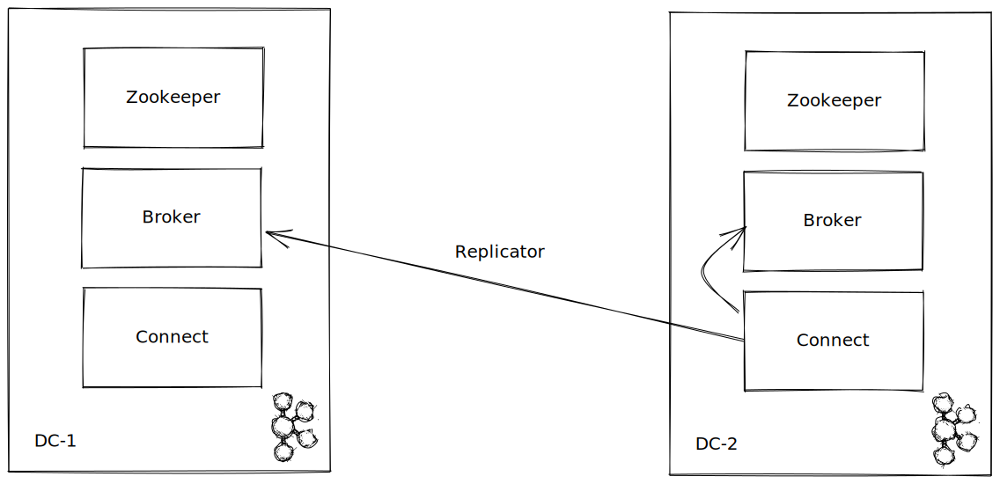

# Replicator demo

## Description

In this demo we have simulated 2 DC and with one replicator inside the destination datacentre we get message from pageviews topic and put them in the destination datacentre.



## Environment startup

```
docker-compose up -d
```

## Generate sample data

```
curl --request PUT \
  --url http://localhost:8083/connectors/pageviews/config \
  --header 'content-type: application/json' \
  --data '{"connector.class": "io.confluent.kafka.connect.datagen.DatagenConnector","kafka.topic": "pageviews","quickstart": "pageviews","iterations": -1}'
```

You can also use [this](connect.dc1.http) if you have installed the _REST Client_ extension on VSCode.

## Run replicator

```
curl --request PUT \
  --url http://localhost:28083/connectors/replicator/config \
  --header 'content-type: application/json' \
  --data '{"connector.class": "io.confluent.connect.replicator.ReplicatorSourceConnector","topic.whitelist": "pageviews","key.converter": "io.confluent.connect.replicator.util.ByteArrayConverter","value.converter": "io.confluent.connect.replicator.util.ByteArrayConverter","src.kafka.bootstrap.servers": "kafka-dc1:9092","src.consumer.group.id": "replicator-dc2-to-dc1-topic1","src.consumer.interceptor.classes": "io.confluent.monitoring.clients.interceptor.MonitoringConsumerInterceptor","src.consumer.confluent.monitoring.interceptor.bootstrap.servers": "kafka-dc1:9092","src.kafka.timestamps.topic.replication.factor": 1,"src.kafka.timestamps.producer.interceptor.classes": "io.confluent.monitoring.clients.interceptor.MonitoringProducerInterceptor","src.kafka.timestamps.producer.confluent.monitoring.interceptor.bootstrap.servers": "kafka-dc1:9092","dest.kafka.bootstrap.servers": "kafka-dc2:9092","confluent.topic.replication.factor": 1,"provenance.header.enable": "true","header.converter": "io.confluent.connect.replicator.util.ByteArrayConverter","tasks.max": "1"}'
```

As above, use [this](connect.dc2.http) if you have _REST Client_.

## Check

Via command line:  
`kcat -b localhost:29092 -C -t pageviews`

You can also check replicators metrics on C3 on the replicators section for the DC2 cluster.
